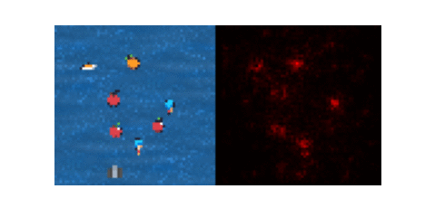

# XAI Project.

This is the last part of the course project.  
In this part, you will have to build a XAI tool for a reinforcement learning agent.  
You will have to use the tools seen in the course, and you can also use other tools if you want.  
You are supposed to return a notebook with your code and explanations. The notebook should be self-sufficient, and should be able to be run without to much effort.

You will try to explain the decisions of a reinforcement learning agent in a simple video game called fruitbot from the [procgen suite](https://openai.com/blog/procgen-benchmark/).
You are not supposed to train the agent yourself, you can use a pretrained agent whose weights are provided [here](https://drive.google.com/file/d/1FnLCCYnvhuT5FBpzH3vjeesztZGhtgSx/view?usp=drive_link).  

Before starting, copy the following files ([agent.py](https://github.com/DavidBert/AIF2024/raw/main/xai/project/agent.py) , [procgen_wrappers.py](https://github.com/DavidBert/AIF2024/raw/main/xai/project/procgen_wrappers.py)) on your folder and install the procgen suite.
    
```bash
pip install procgen
```

You can instanciate the environment with the following code:

```python
import torch
from procgen import ProcgenEnv
from procgen_wrappers import VecExtractDictObs, TransposeFrame, ScaledFloatFrame

env = ProcgenEnv(
        num_envs=1,
        env_name="fruitbot",
        start_level=0,
        num_levels=100,
        distribution_mode='easy',
    )

env = VecExtractDictObs(env, "rgb")
env = TransposeFrame(env)
env = ScaledFloatFrame(env)
```

The _Agent_ class is defined in the agent.py file.  
An agent is composed of a feature extractor and a policy. The feature extractor is a neural network that takes the image as input and outputs a vector of features. The policy is a neural network that takes the features as input and outputs a score for each action. The action with the highest score is the one that is chosen.

You can use it as follows:

```python
from agent import Agent

agent = Agent()
agent.load_state_dict(torch.load('agent_weights.pth'))
agent.eval()
```

The following code shows how to use the agent to play a game:

```python
obs = env.reset()

while True:
    obs = torch.FloatTensor(obs).to('cuda')
    action = agent(obs).argmax(1).cpu().numpy()
    obs, _, done ,_ = env.step(action)
    if done[0]:
        break

env.close()
```

The goal of the project is to explain the decisions of the agent.  
You are exected to produce several gifs that show the agent playing the game and the explanations.  
Here is an example of what could be done:



You can use the tools seen in the course, and you can also use other tools if you want. You are expected to produce three types of explanations.  
Don't be surprised if some methods don't work well on every frame (like grad-CAM), it is normal.

To help you, here is a snippet that shows how to record a gif:

```python
import imageio
from IPython.display import Image
from tqdm.notebook import tqdm
from IPython.display import clear_output
import matplotlib.pyplot as plt
import numpy as np

def obs_to_image(obs):
  return (obs[0].transpose(1,2,0) * 255).astype(np.uint8)

def display_trajectory(frames, fps=25):
  imageio.mimwrite('./tmp.gif',
                [obs_to_image(frame) for i, frame in enumerate(frames)],
                fps=fps)
  return(Image(open('tmp.gif','rb').read(), width=500, height=500))

  frames = []
obs = env.reset()

while True:
    frames.append(obs)
    obs = torch.FloatTensor(obs).to('cuda')
    action = agent(obs).argmax(1).cpu().numpy()
    obs, _, done ,_ = env.step(action)
    img = env.render()
    if done[0]:
        break

env.close()

display_trajectory(frames)
```

You are free to code on your own machine, but you will have to submit a notebook that can be run on [colab](https://colab.research.google.com/github/DavidBert/AIF2024/blob/main/xai/project/XAI_project.ipynb).

Good luck!
